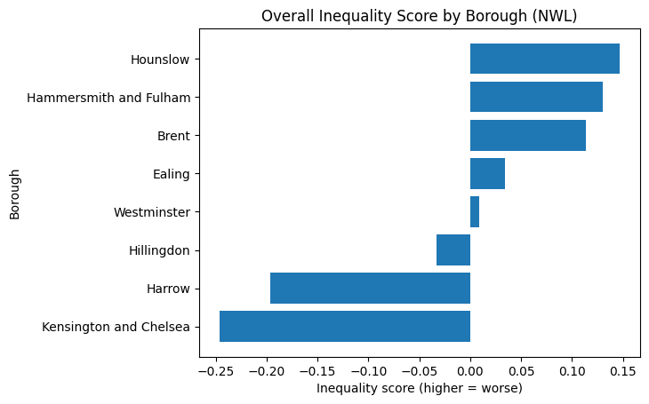
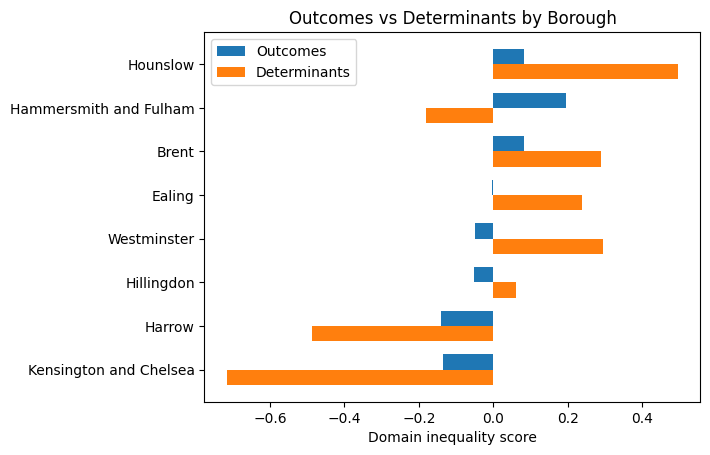
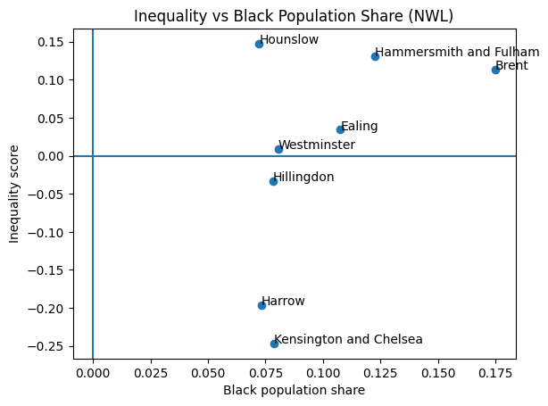

# North West London Health Inequalities Analysis

## Key Insights in plots 
### Overal Inequality by Borough 


#### Higher inequality observed in Hounslow, Brent, and Hammersmith & Fulham.

---

### Outcomes vs Determinents 


#### Different borougs show distict drivers of inequlaity.

---

### Inequality vs Black Population Share 


#### Strongest overlap between inequlaity and Black population share in Brent.

---

## Overview

This project analyses health inequalities across North West London (NWL) boroughs, with a focus on:

* health outcomes
* preventive care
* wider determinants
* ethnicity (with emphasis on Black and African Caribbean communities)

The aim is to build a **data-driven evidence base** to support decision-making for:

* Third Sector Together (3ST)
* VCSE organisations
* NHS Integrated Care Board (ICB) partners

---

## Key Insights

* Health inequalities vary significantly across NWL boroughs
* Different boroughs are driven by different mechanisms:

  * prevention gaps
  * service access issues
  * structural determinants
* Preventive care is a key differentiator of inequality
* Brent shows the strongest overlap between:

  * high inequality
  * weak prevention
  * high Black population share
* Emerging risks are identified in boroughs such as Harrow

---

## Borough Prioritisation

The analysis produces an actionable borough typology:

* **High priority (equity + prevention)**
  → Brent, Hammersmith & Fulham

* **High priority (prevention / structural)**
  → Hounslow

* **Access / pathway focus**
  → Westminster

* **Emerging risk**
  → Harrow

* **Lower burden (monitor)**
  → Hillingdon, Kensington & Chelsea

---

## Project Structure

```plaintext
notebooks/
    End-to-end pipeline from ingestion to modelling

data/
    processed/     → intermediate curated datasets  
    harmonised/    → final analysis-ready datasets  

config/
    mapping and reference files  

outputs/
    final presentation and key outputs
```

---

## Analytical Approach

* Multi-source data integration (ONS, Fingertips, GLA, GPPS)
* Standardisation using z-scores for comparability
* Direction alignment (higher = worse outcomes)
* Composite inequality index at borough level
* Separation of:

  * outcomes
  * determinants
* Preventive care approximation using indicator classification
* Trend analysis over time
* Final synthesis into actionable borough categories

---

## Tools Used

* Python (Pandas, NumPy)
* Data visualisation (Matplotlib)
* Jupyter Notebooks

---

## Outputs

* Borough-level inequality index
* Preventive care analysis
* Trend analysis
* Actionable prioritisation framework
* Executive presentation for stakeholders

---

## Data Sources

All datasets used are publicly available, including:

* Office for National Statistics (ONS)
* Fingertips (OHID)
* Greater London Authority (GLA)
* GP Patient Survey (GPPS)

Data has been cleaned, harmonised, and aggregated for analysis.

---

## Limitations

* Results are **relative measures**, not absolute outcomes
* Preventive care is based on **proxy indicators**
* Limited availability of **ethnicity-disaggregated local data**
* Findings indicate **patterns and signals**, not causality

---

## Author

This project was developed as part of a data science portfolio, demonstrating:

* end-to-end data pipeline design
* multi-source data integration
* applied statistical modelling
* translation of analysis into actionable insights

---
