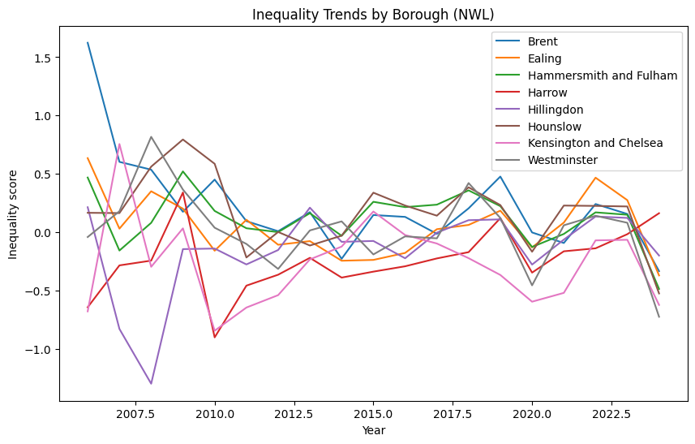

# North West London Health Inequalities Analysis

## Key Insights in plots 
### Comparison of Health Inequality by Borough 
#### Higher inequality observed in Hounslow, Brent, and Hammersmith & Fulham.


---

### Health Outcomes vs Determinents 
#### Different borougs show distinct drivers of inequlaity.


---

## Inequality Trends by Borough
### Inequality across NW London is not static. While several high-burden boroughs show improvement, new areas of inequality are emerging, highlighting the need for both sustained intervention and proactive monitoring.


---
## NW London Borough Inequality Typology

The table below summarises borough-level inequality typologies derived from combined health outcomes, prevention indicators, population structure, and service-access patterns across North West London.

### Interpretation

- Higher inequality scores indicate greater overall inequality burden.
- Preventive inequality score reflects upstream prevention-related risk factors.
- Trend change reflects directional movement over time.
- Recommended actions were generated from borough typology clustering and inequality patterns.

| Borough | Borough Typology | Recommended Action | Inequality Score | Preventive Inequality Score | Black Population Share | Trend Change |
|---|---|---|---:|---:|---:|---:|
| Harrow | Emerging risk | Early intervention and close monitoring | -0.196 | 0.282 | 0.073 | 0.806 |
| Hammersmith and Fulham | High priority: equity + prevention | Targeted outreach, VCSE partnership, prevention | 0.131 | 0.150 | 0.123 | -0.955 |
| Brent | High priority: equity + prevention | Targeted outreach, VCSE partnership, prevention | 0.114 | 0.267 | 0.175 | -1.958 |
| Ealing | High priority: equity + prevention | Targeted outreach, VCSE partnership, prevention | 0.034 | 0.064 | 0.108 | -1.005 |
| Westminster | High priority: outcomes/access | Improve access, pathways, and service responsiveness | 0.009 | -0.454 | 0.081 | -0.684 |
| Hounslow | High priority: prevention | Strengthen early intervention and prevention | 0.147 | 0.154 | 0.072 | -0.691 |
| Hillingdon | Lower burden / monitor | Maintain performance and monitor | -0.033 | -0.107 | 0.078 | -0.414 |
| Kensington and Chelsea | Lower burden / monitor | Maintain performance and monitor | -0.247 | -0.357 | 0.079 | 0.055 |

---

## Overview

This project analyses health inequalities across North West London (NWL) boroughs, with a focus on:

* health outcomes
* preventive care
* wider determinants
* ethnicity (with emphasis on Black and African Caribbean communities)

The aim is to build a **data-driven evidence base** to support decision-making for:

* Third Sector Together (3ST)
* VCSE organisations
* NHS Integrated Care Board (ICB) and partners

---

## Key Insights and Recommendations

* Health inequalities vary significantly across NWL boroughs
* Different boroughs are driven by different mechanisms:

  * prevention gaps
  * service access issues
  * structural determinants
* Preventive care is a key differentiator of inequality
* Brent shows the strongest overlap between:

  * high inequality
  * weak prevention
  * high Black population share
* Emerging risks are identified in boroughs such as Harrow

## Borough Prioritisation typology as a framework for preventive interventions 

The analysis produces an actionable borough typology:

* **High priority (equity + prevention)**
  → Brent, Hammersmith & Fulham

* **High priority (prevention / structural)**
  → Hounslow

* **Access / pathway focus**
  → Westminster

* **Emerging risk**
  → Harrow

* **Lower burden (monitor)**
  → Hillingdon, Kensington & Chelsea

---

## Project Structure

```plaintext
notebooks/
    End-to-end pipeline from ingestion to modelling

data/
    processed/     → intermediate curated datasets  
    harmonised/    → final analysis-ready datasets  

config/
    mapping and reference files  

outputs/
    final presentation and key outputs
```

---

## Analytical Approach

* Multi-source data integration (ONS, Fingertips, GLA, GPPS)
* Standardisation using z-scores for comparability
* Direction alignment (higher = worse outcomes)
* Composite inequality index at borough level
* Separation of:

  * outcomes
  * determinants
* Preventive care approximation using indicator classification
* Trend analysis over time
* Final synthesis into actionable borough categories

---

## Tools Used

* Python (Pandas, NumPy)
* Data visualisation (Matplotlib)
* Jupyter Notebooks

---

## Outputs

* Borough-level inequality index
* Preventive care analysis
* Trend analysis
* Actionable prioritisation framework
* Executive presentation for stakeholders

---

## Data Sources

All datasets used are publicly available, including:

* Office for National Statistics (ONS)
* Fingertips (OHID)
* Greater London Authority (GLA)
* GP Patient Survey (GPPS)

Data has been cleaned, harmonised, and aggregated for analysis.

---

## Limitations

* Results are **relative measures**, not absolute outcomes
* Preventive care is based on **proxy indicators**
* Limited availability of **ethnicity-disaggregated local data**
* Findings indicate **patterns and signals**, not causality

---

## Author

This project was developed as part of a data science portfolio, demonstrating:

* end-to-end data pipeline design
* multi-source data integration
* applied statistical modelling
* translation of analysis into actionable insights

---
